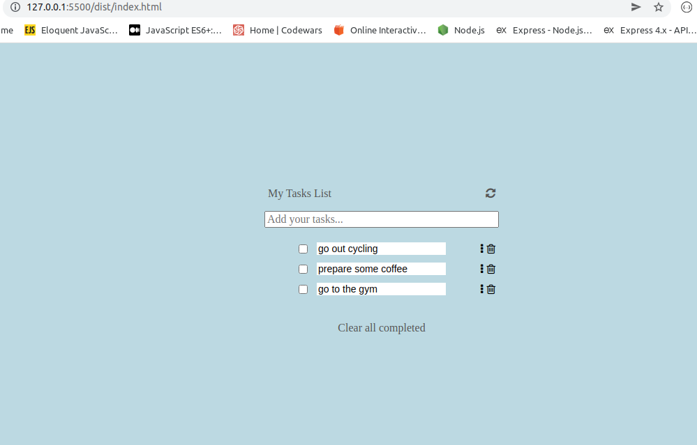

# ToDoList

> A simple implemetation of a simple to-do-list app, using javascript.



Additional description below.

## Built With

- JavaScript
- Webpack
- HTML5
- CSS3

## Live Demo (if available)

[Live Demo Link](https://adudaboazto-do-list.netlify.app/)

## Getting Started

To get a local copy up and running follow these simple example steps.

### Prerequisites

- NodeJS
- VSCode

### Setup

- Clone this repository:

```git clone https://github.com/Aduda-Boaz/ToDoList```

- Move to the cloned folder:

```git cd to-do-list```

### Install

- Run the following from your terminal inside the project directory:

```npm init -y```
```npm install webpack webpack-cli --save-dev```
```npm install --save-dev html-webpack-plugin```
```npm install --save-dev webpack-dev-server```

- Run the following to build the app.

```npm run build```

### Usage

## Author

👤 **Boaz Aduda**

- GitHub: [@Aduda-Boaz](https://github.com/Aduda-Boaz)
- Twitter: [@BoazAduda](https://twitter.com/BoazAduda)
- LinkedIn: [Boaz Aduda]

## 🤝 Contributing

Contributions, issues, and feature requests are welcome!

## Show your support

Give a ⭐️ if you like this project!

## 📝 License

This project is [MIT](./MIT.md) licensed.
